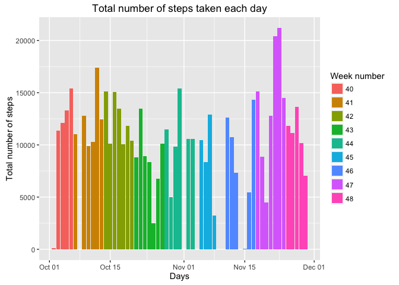
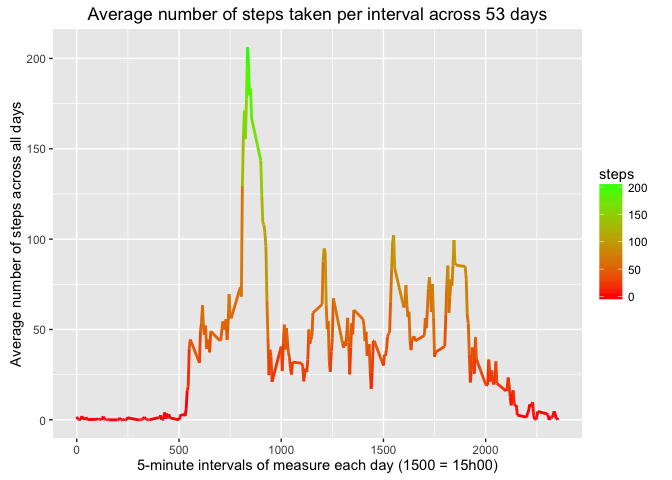
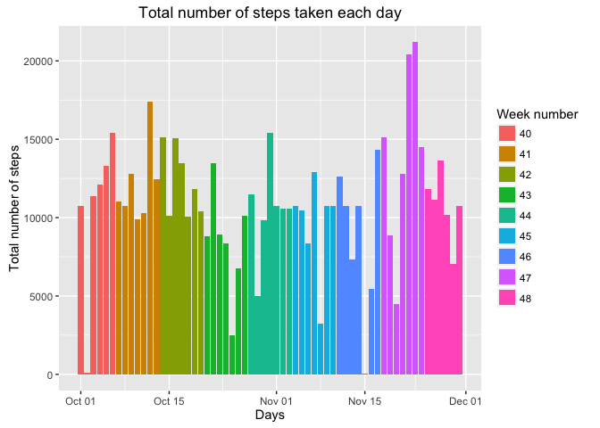
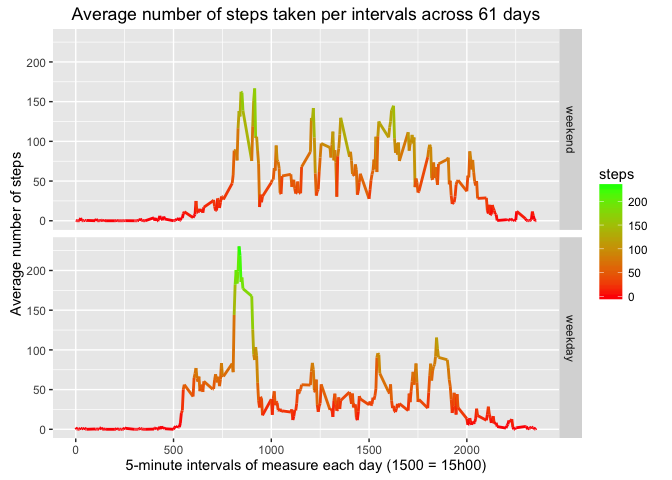

# Reproducible Research: Peer Assessment 1

## Introduction
This assignment makes use of data from a personal activity monitoring device.
The data consists of two months of data from an anonymous individual collected during the months of October and November, 2012 and include the number of steps taken in 5 minute intervals each day.

The variables included in this dataset are:

- steps: Number of steps taking in a 5-minute interval (missing values are coded as NA)
- date: The date on which the measurement was taken in YYYY-MM-DD format
- interval: Identifier for the 5-minute interval in which measurement was taken

The dataset is stored in a comma-separated-value (CSV) file and there are a total of 17,568 observations in this dataset

## 1. Loading and preprocessing the data

The [Activity monitoring data](https://d396qusza40orc.cloudfront.net/repdata%2Fdata%2Factivity.zip) [52K] has been downloaded on February 20th 2016.


```r
# Required R packages to perform the analysis
# We suppress the loading messages to keep the document 'cleaner'
suppressMessages(require(ggplot2))      # Advanced plotting system
suppressMessages(require(lubridate))    # Dates manipulation
suppressMessages(require(dplyr))        # Simple commands for imputing data
```


```r
# If there is no file named "activity.csv", we unzip the file from the repository in the current directory.
if (!file.exists("./activity.csv")) {
  unzip("./activity.zip", exdir = ".")
}

# Read activity data: activity.csv
activity_data <- read.csv(file = "./activity.csv", header = TRUE)

# Data overview
str(activity_data)
```

```
## 'data.frame':	17568 obs. of  3 variables:
##  $ steps   : int  NA NA NA NA NA NA NA NA NA NA ...
##  $ date    : Factor w/ 61 levels "2012-10-01","2012-10-02",..: 1 1 1 1 1 1 1 1 1 1 ...
##  $ interval: int  0 5 10 15 20 25 30 35 40 45 ...
```

```r
# Number of days of activity
paste("Number of days of observations: ", length(unique(activity_data$date))) # 61
```

```
## [1] "Number of days of observations:  61"
```

```r
# Quick variables study:
#   - steps: have lot of missing values
#   - dates: need to be coarsed as Dates
#   - interval: represents time interval but there is no need to alter the values or type for computation
activity_data$date <- as.Date(activity_data$date, format = "%Y-%m-%d")
```

## 2. What is mean total number of steps taken per day?
For this part of the assignment, we ignore the missing values (NA) in the dataset when aggregating the total number of steps per day.


```r
# Total number of steps taken per day: we ignore the NA. Returns dataframe.
total_steps_day <- aggregate(steps ~ date, activity_data, sum, na.action = na.omit)
# Number of days with complete data
paste("Number of days with complete observations: ", nrow(total_steps_day)) # 53
```

```
## [1] "Number of days with complete observations:  53"
```

* 2.1 Make a histogram of the total number of steps taken each day


```r
# We use stat = identity since the total number of steps is a value from the variable `steps` 
# We color per week to highlight potential weekly pattern : fill = factor(week(date)
p_total_steps <- ggplot(total_steps_day, aes(x = date, y = steps, fill = factor(week(date))))
p_total_steps <- p_total_steps + geom_bar(size = 2, stat = "identity")
p_total_steps <- p_total_steps + ggtitle("Total number of steps taken each day")
p_total_steps <- p_total_steps + scale_fill_discrete(name = "Week number")
p_total_steps + xlab("Days") + ylab("Total number of steps")  
```

\


* 2.2 Calculate and report the `mean` and `median total number of steps` taken per day


```r
# Mean total number of steps taken per day
mean_steps_day <- round(mean(total_steps_day$steps), digits = 2)
# Mean = 10766.19 steps per day
paste ("Mean of total number of steps: ", mean_steps_day)
```

```
## [1] "Mean of total number of steps:  10766.19"
```

```r
# Median total number of steps taken per day?
median_steps_day <- median(total_steps_day$steps)
# Median = 10765 steps per day
paste ("Median of total number of steps: ", median_steps_day)
```

```
## [1] "Median of total number of steps:  10765"
```

## 3. What is the average daily activity pattern?
* 3.1 Make a time series plot (i.e. type = "l") of the 5-minute interval (x-axis) and the average number of steps taken, averaged across all days (y-axis)


```r
# Average number of steps taken per interval across all days
mean_steps_int <- aggregate(steps ~ interval, activity_data, mean, na.action = na.omit)

# Get an overview of average number of steps per interval before plotting the values
summary(mean_steps_int$steps)
```

```
##    Min. 1st Qu.  Median    Mean 3rd Qu.    Max. 
##   0.000   2.486  34.110  37.380  52.830 206.200
```

```r
# Plot the result using ggplot2 library.
p_mean_steps_int <- ggplot(mean_steps_int, aes(x = interval, y = steps, color = steps))
p_mean_steps_int <- p_mean_steps_int + geom_line(size = 1) +  scale_colour_gradient(low="red", high ="green")
p_mean_steps_int <- p_mean_steps_int + ggtitle("Average number of steps taken per interval across 53 days") 
p_mean_steps_int + xlab("5-minute intervals of measure each day (1500 = 15h00)") + ylab("Average number of steps across all days")  
```

\


* 3.2 Which 5-minute interval, on average across all the days in the dataset, contains the maximum number of steps?


```r
# Compute maximum number of steps
max_steps <- max(mean_steps_int$steps) # 206 steps
# Get the corresponding interval
max_mean_steps_int <- mean_steps_int[mean_steps_int$steps == max_steps, ]$interval
paste("Interval containing the maximum number of steps: ", max_mean_steps_int)
```

```
## [1] "Interval containing the maximum number of steps:  835"
```

```r
paste("Maximum number of steps (rounded to 2 digits): ", round(max_steps, digits = 2))
```

```
## [1] "Maximum number of steps (rounded to 2 digits):  206.17"
```

At 8h35 in the morning, we observe the maximum number of steps: 206.2 (average computed across the 53 days).

## 4. Imputing missing values
* 4.1 Calculate and report the total number of missing values in the dataset 


```r
# Sum up the numer of missing values
nb_missing <- sapply(activity_data, function(x) sum(is.na(x)))
paste ("Number of missing values: ", nb_missing[1])
```

```
## [1] "Number of missing values:  2304"
```

```r
# Rows that include NA are not complete.
nb_row_missing <- nrow(activity_data[!complete.cases(activity_data), ])
paste ("Number of uncompleted records: ", nb_row_missing)
```

```
## [1] "Number of uncompleted records:  2304"
```

* 4.2 Strategy for filling in all of the missing values in the dataset. 

- In question 1, we noticed that 2 weeks have 2 days of missing data each, and that there is no specific pattern on a given week, or on a specific day of a week. 
- The most obvious pattern is shown at the interval level with a peak reached for the interval `835`. We believe it's better to impute data using an average at the interval level across all days, to avoid too much "distordance" when replacing the missing data.
- Each missing value in the **activity_data** dataframe will be replaced by the average across all days of the interval values.

* 4.3 Create a new dataset that is equal to the original dataset but with the missing data filled in.


```r
# Create function that replace NA values by the mean of the values that are not missing
impute.mean <- function(x) replace(x, is.na(x), mean(x, na.rm = TRUE))

# Group observations by interval before computing the mean
activity_data_full <- group_by(activity_data, interval)
# Replace missing values by the average of the values across all other days of each particular interval
activity_data_full <- mutate(activity_data_full, steps = impute.mean(steps))
```

* 4.4 Make a histogram of the total number of steps taken each day


```r
# Compute the total number of steps per day on the full dataset, which includes the imputed values
total_full_steps <- aggregate(steps ~ date, activity_data_full, sum)

# Plot the result using ggplot2 library. We color per week: fill = factor(week(date)
p_full_steps <- ggplot(total_full_steps, aes(x = date, y = steps, fill = factor(week(date))))
p_full_steps <- p_full_steps + geom_bar(size = 2, stat = "identity")
p_full_steps <- p_full_steps + ggtitle("Total number of steps taken each day") 
p_full_steps <- p_full_steps + scale_fill_discrete(name = "Week number")
p_full_steps + xlab("Days") + ylab("Total number of steps")  
```

\


* Calculate and report the **mean** and **median** total number of steps taken per day.


```r
# Mean total number of steps taken per day?
mean_full_steps_day <- round(mean(total_full_steps$steps), digits = 2)
# Mean = 10766.19 steps per day
paste ("Mean of total number of steps: ", mean_full_steps_day)
```

```
## [1] "Mean of total number of steps:  10766.19"
```

```r
# Median total number of steps taken per day?
median_full_steps_day <- median(total_full_steps$steps)
# Median = 10766.19 steps per day
paste ("Median of total number of steps: ", round(median_full_steps_day, digits = 2))
```

```
## [1] "Median of total number of steps:  10766.19"
```

```r
# Verification - number of days 
# 8 days have been added with imputed values to the original dataset, which had initially only 53 days of completed values.
paste ("Number of days with only imputed values: ", 
       nrow(total_full_steps[round(total_full_steps$steps, digits = 2) == 10766.19, ]))
```

```
## [1] "Number of days with only imputed values:  8"
```

When using the dataset with imputed value, we notice that the `mean` and the `median` have the same value. We do have a symetric distribution of the observations across all days.

## 5. Are there differences in activity patterns between weekdays and weekends?
* 5.1 Create a new factor variable in the dataset with two levels -- `weekday` and `weekend` indicating whether a given date is a weekday or weekend day.


```r
# Use function that return whether a day is in the week-end or not
dayweek <- function(x) { weekdays(x) %in% c("Saturday", "Sunday") }

# Add weekday as factor to the dataframe that includes imputed values
activity_data_full$daytype = factor(dayweek(activity_data_full$date), 
                                    levels = c(TRUE, FALSE), 
                                    labels = c("weekend", "weekday"))
```

* 5.2 Make a panel plot containing a time series plot (i.e. `type = "l"`) of the 5-minute interval (x-axis) and the average number of steps taken, averaged across all weekday days or weekend days (y-axis).


```r
# Average number of steps taken per interval, per day type (week day or weekend) across all days
mean_steps_int_wday <- aggregate(steps ~ interval + daytype, activity_data_full, mean)

# Plot the result using ggplot2 library: we use facet_grid() to split the plots per weekday and per wekend
p_m_steps_wday <- ggplot(mean_steps_int_wday, aes(x = interval, y = steps, color = steps))
p_m_steps_wday <- p_m_steps_wday + geom_line(size = 1) +  scale_colour_gradient(low="red", high ="green") + facet_grid(daytype ~.)
p_m_steps_wday <- p_m_steps_wday + ggtitle("Average number of steps taken per intervals across 61 days") 
p_m_steps_wday + xlab("5-minute intervals of measure each day (1500 = 15h00)") + ylab("Average number of steps")  
```

\


* Answer: yes, there are differences between weekdays and weekend. During weekdays, the activity is consistant across the day whereas during weekends, there is a peak activity in the morning (8h35) and lower activity during the rest of the day.


                               ----------------- End of the analysis ----------------- 
